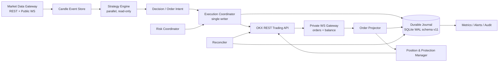
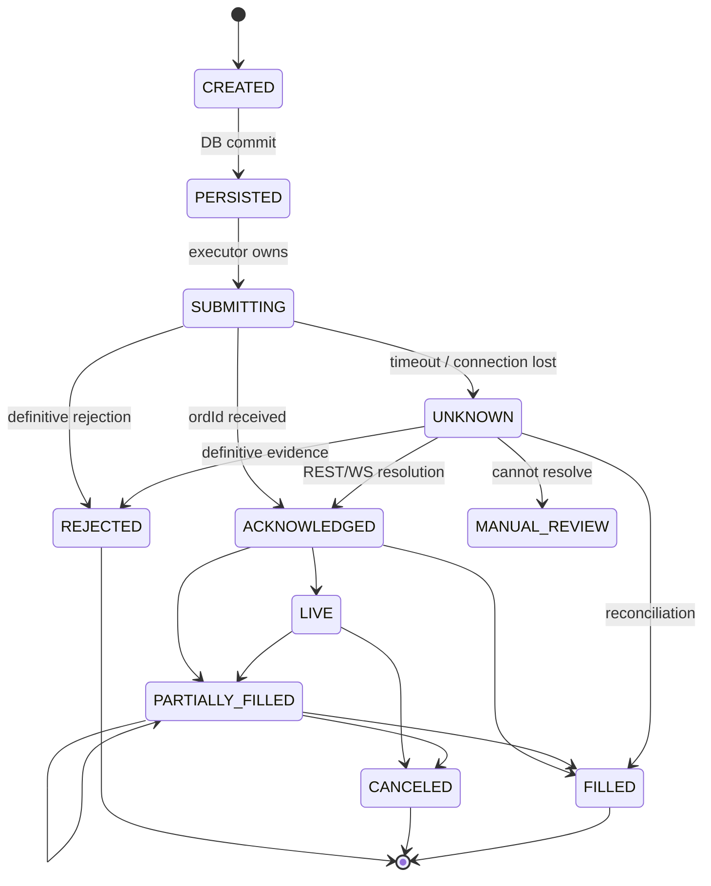
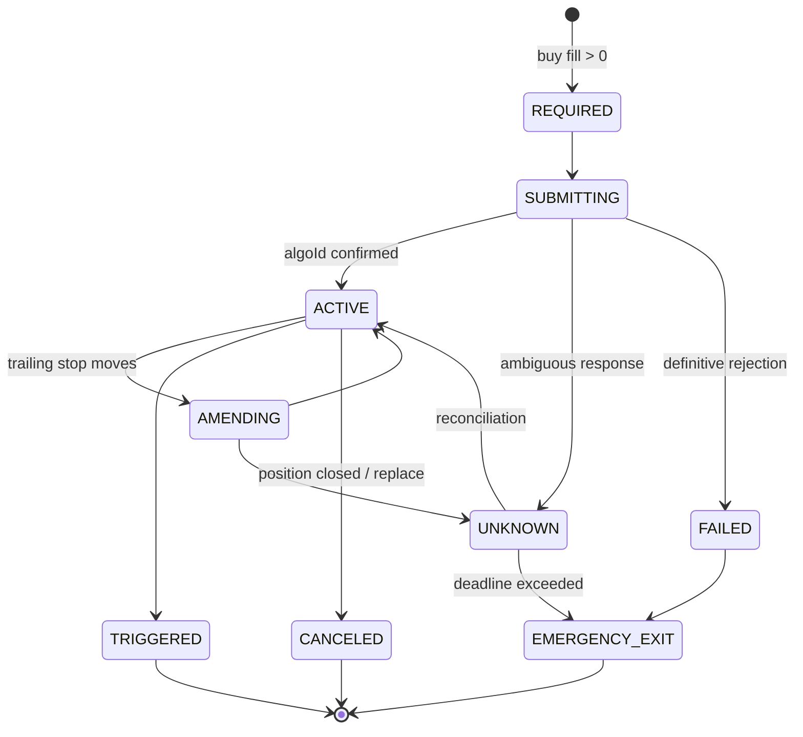
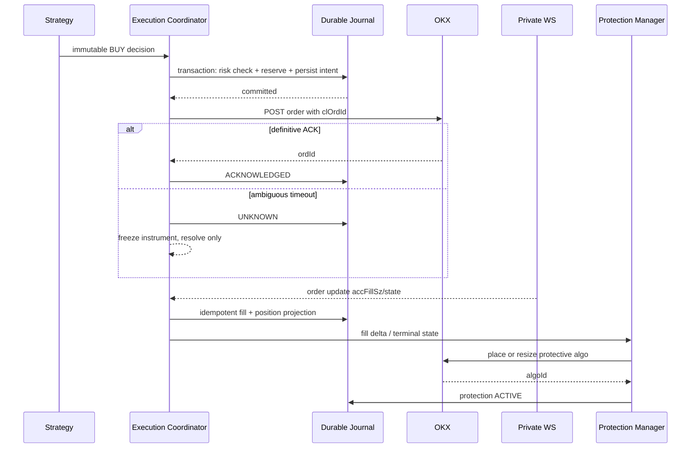
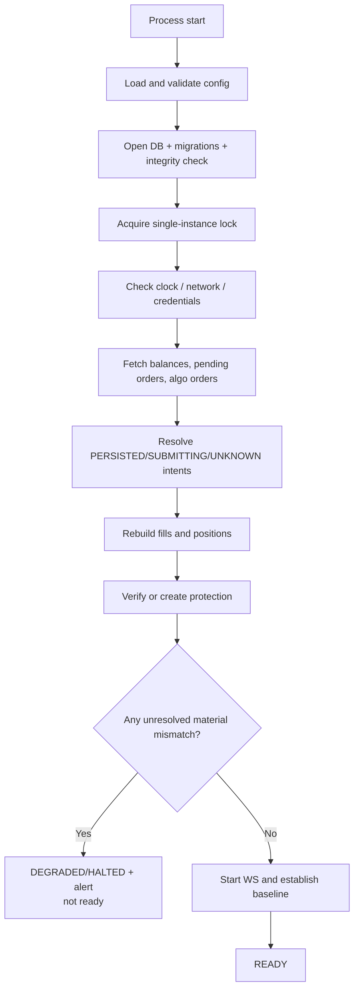

# OKX Quant 生产级升级方案

状态：生产候选方案基线（代码实施状态见 [IMPLEMENTATION_STATUS.md](IMPLEMENTATION_STATUS.md)，
生产准入状态见 [RELEASE_CHECKLIST.md](RELEASE_CHECKLIST.md)）

版本：1.0

日期：2026-07-27

适用范围：OKX 现货、USDT 计价、只做多、单账户、多交易对

> 当前状态：Phase 0–7 的仓库内能力已经实现并通过自动门禁；需要 OKX 凭据、真实
> 基础设施、连续运行时间或人工审批的项目仍保持开放。完成代码实施不等于生产准入，
> 以发布清单的签署结果为唯一准入结论。

## 1. 目标与非目标

### 1.1 生产目标

本方案把当前项目升级为一个“可审计、可恢复、故障时优先缩小风险”的交易系统。
生产级不等于零故障，而是任何故障都有明确状态、不会盲目重复下单、能够从交易所
事实恢复，并且维护者能及时知道系统是否仍安全。

必须满足的核心不变量：

1. 没有先持久化的订单意图，不允许向交易所发送订单。
2. 收到 `ordId` 不等于成交；仓位只能由累计成交事实推导。
3. 网络超时后的订单状态是 `UNKNOWN`，不允许盲目重试。
4. 停盘只禁止增加风险，任何减仓和平仓路径始终可用。
5. 有实际仓位时，必须存在有效的交易所保护单，或进入明确的紧急状态并告警。
6. 本地状态与交易所不一致时，冻结新增风险，以交易所订单、成交和余额为事实来源。
7. 同一根已完成 K 线只能生成一次可执行决策。
8. 所有金额和数量使用 `Decimal` 或交易所精度整数，不使用二进制 `float` 作为账务事实。

### 1.2 非目标

首个生产版本不建设：

- 高频或微秒级交易；
- 多交易所智能路由；
- 多账户资金调度；
- 主动—主动多实例执行；
- 衍生品、杠杆、做空；
- 自动扩大资金规模；
- 依赖 LLM 的无人工监督全权交易。

这些约束让系统可以采用“模块化单体 + 单写者执行器”，避免为了看起来先进而引入
分布式一致性问题。

## 2. 服务等级与安全指标

### 2.1 建议 SLO

| 指标 | 目标 |
|---|---:|
| 行情与账户事件处理可用性 | 月度 ≥ 99.5% |
| 已确认成交到保护单 ACTIVE | 正常 p95 ≤ 3 秒，p99 ≤ 10 秒 |
| 无保护仓位告警 | 发现后 ≤ 5 秒 |
| 订单状态 UNKNOWN 告警 | 发现后 ≤ 10 秒 |
| 周期性对账间隔 | 30 秒 |
| WS 断线发现 | ≤ 20 秒 |
| 进程重启后完成对账 | ≤ 60 秒 |
| 订单审计记录 RPO | 进程故障为 0；主机磁盘故障 ≤ 5 分钟并从 OKX 重建交易事实 |
| 单机故障 RTO | 自动重启 ≤ 2 分钟；主机故障人工恢复 ≤ 30 分钟 |

SLO 是系统验收指标，不是收益承诺。
对于 Demo 正式准入，独立保护样本不足 300 时，p99 只报告、不作为独立统计门槛；
使用聚合 p95≤3 秒、全样本 max≤10 秒和失败率为零作为硬门，详见
`DEMO_SHADOW_VALIDATION_PLAN.md`。

### 2.2 风险预算

以下参数必须成为配置项并有硬上限：

- 单笔最大损失；
- 单交易对最大名义仓位；
- 账户总风险敞口；
- 最大同时持仓数；
- 单日已实现亏损；
- 账户峰值回撤；
- 每小时最大订单意图数；
- 最大允许 spread、滑点和行情年龄；
- 最大无保护仓位持续时间；
- 连续 API/WS/数据库错误阈值。

“硬上限”分为两种执行语义，不能混为一谈：

| 类别 | 触发条件 | 动作 |
|---|---|---|
| `HALT_ACCOUNT` | 已经发生的账户状态越界：日损、回撤、当前总敞口/持仓数已超预算、无保护仓位、连续基础设施错误 | 持久锁存 `HALTED`/`EMERGENCY_EXIT` 并 Page，人工审批后才可恢复 |
| `REJECT_CANDIDATE` | 某个候选 BUY 会造成越界，或市场质量暂时不合格：单笔损失/名义金额、候选仓位槽位、订单频率、spread、滑点、行情年龄、流动性、allowlist | 原子拒绝该意图，不把暂时性市场条件升级为需人工恢复的账户停机 |

因此“spread 过宽”只拒绝当前 BUY；若交易所权威事实显示账户已经超过总敞口或
持仓数预算，则属于 `HALT_ACCOUNT`。所有 SELL、保护和减仓路径不受 entry-only
拒绝限制。

达到硬限制后进入 `HALTED`。`HALTED` 禁止所有新 BUY，但允许 SELL、撤单、保护单
修复和对账。

## 3. 目标架构

### 3.1 组件关系



### 3.2 设计选择

#### 模块化单体

策略、执行、对账和监控在一个部署单元中，但通过领域接口隔离。这样保留当前项目的
易部署特性，同时避免多个服务之间的分布式事务。

#### 单写者执行器

多交易对策略可以并行计算，但只有 `ExecutionCoordinator` 可以创建订单意图、预留
资金和调用交易 API。当前每个 worker 直接下单的模式应改为：

```text
worker -> immutable decision -> bounded queue -> single execution coordinator
```

它使账户级现金、风险预留和订单频率在一个事务边界内完成。

#### 持久化选择

第一生产版本采用 SQLite WAL，条件是：

- 数据库位于本机持久磁盘，不放 NFS；
- `journal_mode=WAL`；
- `synchronous=FULL`；
- `foreign_keys=ON`；
- `busy_timeout` 明确配置；
- 只允许一个写执行器；
- 定时在线备份并验证恢复。

当前单账户、低订单频率和 1GB 主机不需要立即引入 PostgreSQL。出现以下任一条件时
迁移 PostgreSQL：

- 多执行实例；
- 主动—被动自动切换；
- 远程分析服务直接读写交易库；
- 每秒持续数十笔以上订单事件；
- 需要数据库级高可用。

Repository 接口必须与 SQLite 解耦，为迁移保留边界。

## 4. 领域状态模型

### 4.1 订单意图状态机



规则：

- 交易 API 返回连接超时、TLS 断开或网关异常时，不判断为失败，进入 `UNKNOWN`。
- `UNKNOWN` 订单占用风险预留，冻结该交易对的新意图。
- 只有 Resolver/Reconciler 可以把 `UNKNOWN` 推进到终态。
- 状态转换必须带乐观锁版本号，非法倒退直接拒绝并告警。
- WebSocket 重复、乱序消息必须幂等处理。

### 4.2 成交模型

OKX orders channel 的 `accFillSz` 是累计成交量，`fillSz` 是最近一次成交量。系统以
累计量差值或唯一 `tradeId` 生成 fill，不能把每次消息中的 `fillSz` 无条件累加。

```text
delta = max(exchange.accFillSz - local.accFillSz, 0)
```

优先使用 `tradeId` 去重；若事件没有 `tradeId` 但订单已是 `filled`，使用
`(ordId, accFillSz, state)` 幂等键。

仓位计算：

```text
base_position =
    sum(buy filled base qty)
  - sum(sell filled base qty)
  - base-denominated fees
  + reconciliation adjustments
```

仓位不能在下单 ACK 时创建，也不能在卖单 ACK 时删除。

### 4.3 `clOrdId` 规则

OKX 只保证 pending 订单中的 `clOrdId` 唯一，历史上允许复用；系统内部必须采用更强
规则：永不复用。

推荐格式：

```text
Q + 25位Base32随机ID + 方向码 + 校验位
```

要求：

- 总长度不超过 32；
- 只用大小写字母和数字；
- 数据库唯一约束；
- 发送前持久化；
- 查询优先使用 `ordId`，`clOrdId` 作为超时恢复索引；
- 不使用时间戳单独生成，避免同毫秒冲突。

### 4.4 保护单状态机



保护单目标数量必须跟随实际累计成交量，而不是原始委托数量。

## 5. 数据库模型

所有数量、价格、费用在数据库中存为规范化十进制字符串或按交易所精度缩放后的整数。
禁止用 SQLite `REAL` 存储账务事实。

### 5.1 核心表

#### `decisions`

| 字段 | 说明 |
|---|---|
| `decision_id` | UUID/ULID，主键 |
| `strategy_name/version` | 策略和参数版本 |
| `inst_id` | 交易对 |
| `candle_ts` | 已完成 K 线时间，参与唯一约束 |
| `signal` | BUY/SELL/HOLD |
| `requested_size_pct` | 原始建议 |
| `reason` / `inputs_hash` | 审计信息 |
| `created_at` | 创建时间 |

唯一约束：`(strategy_instance_id, inst_id, candle_ts)`。

#### `order_intents`

| 字段 | 说明 |
|---|---|
| `intent_id` | 主键 |
| `cl_ord_id` | 永久唯一 |
| `decision_id` | 来源决策，可为空（风控/恢复卖出） |
| `inst_id`, `side` | 交易对与方向 |
| `requested_base_qty` | 请求数量 |
| `reserved_quote` | BUY 预留现金 |
| `state` | 本地订单状态 |
| `exchange_ord_id` | OKX ordId |
| `exchange_state` | 原始状态 |
| `acc_fill_qty`, `avg_fill_px` | 累计成交 |
| `fee`, `fee_ccy` | 累计费用 |
| `version` | 乐观锁 |
| `last_error_code/message` | 最后错误 |
| `created_at/updated_at` | 时间 |

索引：

- unique `cl_ord_id`；
- unique nullable `exchange_ord_id`；
- `(state, updated_at)`；
- `(inst_id, state)`。

#### `fills`

| 字段 | 说明 |
|---|---|
| `fill_id` | 本地主键 |
| `trade_id` | OKX tradeId |
| `exchange_ord_id` | 所属订单 |
| `inst_id`, `side` | 交易对与方向 |
| `fill_qty`, `fill_px` | 成交量价 |
| `fee`, `fee_ccy` | 费用 |
| `exchange_ts` | 交易所时间 |

唯一约束优先 `(inst_id, trade_id)`；无 tradeId 的终态补偿事件使用独立幂等键。

#### `positions`

存储可快速读取的投影，不作为唯一事实源：

- `inst_id`；
- `base_qty`；
- `available_qty`；
- `avg_entry_px`；
- `realized_pnl`；
- `highest_since_entry`；
- `protection_status`；
- `version`；
- `updated_at`。

它可以由 `fills + reconciliation_adjustments` 重建。

#### `protective_orders`

- `protection_id`；
- `inst_id`；
- `algo_cl_ord_id`；
- `exchange_algo_id`；
- `kind`：SL/TP/OCO/TRAIL；
- `protected_qty`；
- `trigger_px/order_px`；
- `state`；
- `parent_intent_id`；
- `version`；
- 时间与错误信息。

#### 其它表

- `account_snapshots`：权益、可用现金、快照时间和来源；
- `reconciliation_runs`：每次对账结果、差异和修复动作；
- `risk_reservations`：未决 BUY 的现金与仓位槽位预留；
- `system_events`：HALT、WS 断线、配置变更、人工操作；
- `outbox_events`：事务内记录待发布的指标/告警事件。

### 5.2 事务边界

创建 BUY 意图时，一个事务内完成：

1. 验证系统状态允许新增风险；
2. 读取最新可信账户投影；
3. 检查持仓和 pending intent；
4. 创建风险预留；
5. 插入 `order_intents(PERSISTED)`；
6. 写审计事件；
7. 提交；
8. 提交成功后才允许调用 OKX。

任何一步失败都不能发送订单。

## 6. 交易执行流程

### 6.1 买入



### 6.2 卖出

退出数量取以下最小值：

```text
min(
    local position projection,
    exchange total balance,
    exchange available balance after resolving locked orders
)
```

如果 `total > 0` 但 `available = 0`：

1. 查询 pending 普通订单和 algo orders；
2. 判断是否已有退出订单占用；
3. 不清除本地仓位；
4. 若重复退出已存在，关联到原 intent；
5. 若未知冻结，进入 `DEGRADED` 并告警。

退出成交后取消剩余保护单；取消确认前不能认为保护单已不存在。

### 6.3 主动退出与保护单竞争

策略 SELL、人工 flatten、本地紧急退出和交易所保护单可能同时尝试出售同一份余额。
每个交易对必须有持久化的 `exit lease`，同一时刻只有一个退出流程拥有执行权。

主动退出流程：

1. 事务内取得 exit lease，并把仓位标记为 `EXITING`；
2. 查询保护单最新状态；
3. 若保护单已触发，关联它生成的普通订单并等待成交，不再重复 SELL；
4. 若保护单仍 ACTIVE 且冻结余额，提交 cancel；
5. 必须收到 cancel/effective/triggered 的明确结果，再决定是否发市价 SELL；
6. 确认可用余额释放后提交持久化的退出 intent；
7. 根据真实成交量更新仓位；
8. 仓位归零后清理剩余保护单并释放 exit lease。

取消保护单到市价 SELL 之间会出现保护缺口，因此：

- 该流程使用最高优先级执行队列，不等待策略周期；
- 超过 3 秒未完成立即告警；
- cancel 状态未知时不允许假设已取消，更不能重复卖出；
- 是否冻结 SPOT 余额以及触发后生成订单的具体行为必须由模拟盘 contract test 固化。

保护单触发事件和本地主动退出同时到达时，以交易所订单事实为准，并依靠 exit lease、
`ordId`/`algoId` 关联及累计成交量保证幂等。

### 6.4 不盲目重试

| 操作 | 重试策略 |
|---|---|
| 公共 GET | 指数退避，可安全重试 |
| 私有 GET | 指数退避，可安全重试 |
| POST 下单，明确业务拒绝 | 不重试，记录 REJECTED |
| POST 下单，HTTP/TLS 超时 | 标记 UNKNOWN，按 clOrdId/ordId 查询 |
| Cancel/Amend 超时 | 标记 UNKNOWN，查询实际状态 |
| 限速 | 尊重 Retry-After，并进入全局 rate limiter |

## 7. OKX 保护单策略

### 7.1 当前接口约束

当前系统使用 SPOT market buy、`tgtCcy=base_ccy`，生产路径固定为成交后独立 OCO。
本仓库不把 `base_ccy + attachAlgoOrds` 的兼容性当作已证事实，也不在普通订单请求体
中启用它；quote 金额 attached 路线仅由真实 demo contract 探测，结果必须随发布证据
保存。

生产实施前必须在模拟盘验证两条路线：

#### 路线 A：按 quote 金额买入并附带紧急保护

- 改用 `tgtCcy=quote_ccy`；
- 下单时附带一个保守的紧急 SL；
- 父订单成交后读取 `avgPx`/`accFillSz`；
- 将保护价和数量修改到真实成交基准；
- 验证部分成交、父单取消和 attached algo 创建行为。

优势：保护窗口最短。

风险：下单数量语义改变，attached algo 在部分成交场景的行为必须通过模拟盘 contract
test 证明。

#### 路线 B：成交后提交独立 OCO/conditional

- 普通市价买单确认成交；
- 按实际净到账数量提交独立 algo order；
- 在 `ACTIVE` 前系统处于 `PROTECTION_PENDING`；
- 超过 3 秒未 ACTIVE 触发最高级别告警；
- 超过 10 秒或明确失败，执行紧急市价退出。

优势：数量和成交锚点更清晰。

风险：成交到保护激活之间存在短窗口。

建议先实现路线 B，逻辑更可控；路线 A 在模拟盘验证稳定后作为优化。

### 7.2 移动止损

生产版本的 trailing stop 不能只更新本地字段：

1. 计算新止损；
2. 仅允许上移；
3. 价格变化达到 `tickSz` 和最小修改阈值后才提交；
4. amend 请求带唯一 `reqId`；
5. 等待 WS/REST 确认；
6. amend 状态未知时保留旧保护单假设，不并发 cancel-replace；
7. 若交易所不支持目标类型 amend，执行“先新后旧”或经过验证的安全替换流程。

禁止未经验证地先取消旧保护单再创建新单。

## 8. WebSocket 与行情

### 8.1 通道

至少接入：

- Private `/ws/v5/private`：orders；
- Private `/ws/v5/private`：balance_and_position；
- Business `/ws/v5/business`：orders-algo；
- Public：candle/ticker，可选 order book。

REST 仍保留为启动快照、断线补偿和对账来源。WS 是低延迟事件流，不是唯一事实来源。

### 8.2 连接状态

每条连接维护：

- `DISCONNECTED`；
- `CONNECTING`；
- `AUTHENTICATING`；
- `SUBSCRIBING`；
- `READY`；
- `STALE`；
- `BACKOFF`。

没有收到初始订阅确认不能进入 `READY`。orders channel 不推初始快照，因此订阅成功后
必须主动用 REST 拉取 pending orders 形成基线。

### 8.3 重连流程

```text
mark gateway STALE
freeze new BUY
reconnect + authenticate + subscribe
REST fetch pending orders / order details / balances / algo orders
apply reconciliation
record new event watermark
only then READY
```

### 8.4 K 线幂等

当前代码已经过滤未完成 K 线。进一步增加：

- `(inst_id, bar, candle_ts)` 唯一键；
- 每个策略实例保存 `last_processed_candle_ts`；
- 重复轮询同一已完成 K 线只更新 dashboard，不再调用策略；
- 缺口超过一个 bar 时停止新 BUY，补齐数据后恢复；
- 本机时间与 OKX server time 偏差超过 1 秒时停止交易。

## 9. 启动恢复与周期性对账

### 9.1 启动状态机



在 `READY` 前不运行策略，不允许新订单。

### 9.2 对账来源优先级

1. 订单详情和订单历史；
2. 成交记录/fills；
3. pending 普通订单；
4. pending 与历史 algo orders；
5. 账户余额；
6. 本地事件日志和投影。

余额是最终持有数量，但无法单独说明成交来源；订单/成交和余额必须联合解释。

### 9.3 差异策略

| 差异 | 动作 |
|---|---|
| 交易所有余额，本地无仓 | 重建仓位，创建保护，告警 |
| 本地有仓，交易所总余额为零 | 查询 fills/订单后关闭投影，记录修正 |
| available 为零但总余额存在 | 查询冻结订单，保留仓位 |
| pending 订单本地不存在 | 导入为 external order，冻结交易对 |
| 本地 UNKNOWN，交易所按 clOrdId 找到 | 关联并推进状态 |
| 本地 UNKNOWN 无法在历史窗口找到 | MANUAL_REVIEW，禁止自动重试 |
| 保护量小于真实仓位 | 立即补足保护 |
| 孤儿保护单但无仓位 | 确认后取消 |
| 数量差异小于交易所 dust | 记录 dust，不占持仓槽位 |

自动修复必须保守；任何可能增加仓位的修复都禁止自动执行。

## 10. 风控体系

### 10.1 风控分层

#### 配置时

- 参数范围校验；
- fast period < slow period；
- 止损必须低于预期买入价；
- take profit 必须高于预期买入价；
- 最大仓位和总敞口不能超过硬上限；
- 实盘配置必须显式声明环境和账户 ID。

#### 信号时

- candle 已完成且新鲜；
- 数据连续；
- spread、波动率和流动性合格；
- 策略置信度和冷却满足；
- 同 candle 幂等。

#### 下单前

- 系统状态 READY；
- DB、orders WS、账户快照新鲜；
- 没有 UNKNOWN/pending 冲突；
- 组合级现金和风险预留；
- 数量经过 lotSz/minSz；
- 价格偏离和最大滑点保护；
- 订单频率限制。

#### 持仓中

- 保护单存在且数量足够；
- 最大回撤和日损；
- stale market data；
- 持仓与余额一致；
- trailing stop 只收紧不放松。

### 10.2 系统模式

| 模式 | 新 BUY | SELL | 对账/保护修复 |
|---|---:|---:|---:|
| `STARTING` | 否 | 仅恢复动作 | 是 |
| `READY` | 是 | 是 | 是 |
| `DEGRADED` | 否 | 是 | 是 |
| `HALTED` | 否 | 是 | 是 |
| `EMERGENCY_EXIT` | 否 | 是 | 是 |
| `MAINTENANCE` | 否 | 人工控制 | 是 |

### 10.3 Kill switch

提供三个明确操作：

- `halt-entries`：停止新 BUY，保留并维护仓位及保护单；
- `resume-entries`：仅由运行中唯一写者验证独立风险审批人的短效 Ed25519 签名
  artifact；凭证绑定 command ID、账户 UID、配置哈希、精确确认词和有效期，只能
  消费一次；随后账户/时钟、Page challenge、WS baseline/事件 fence、联合对账
  全部通过，并以硬状态单调 epoch 的 CAS 确认期间没有更新的 halt 意图，才解除
  `HALTED`/`MAINTENANCE`；
- `flatten-and-cancel`：使用同一套短效 Ed25519 双人批准，额外绑定精确交易对集合；
  验签后取消普通挂单，市价退出仓位，确认成交后取消保护单。

第二个操作属于增加风险权限的高危动作，交易进程只持有审批公钥，不能自行伪造第二
人批准；必须有显式命令、精确确认和审计日志，不能由普通 dashboard 按键误触。

## 11. 可观测性与告警

### 11.1 结构化日志

每条日志包含：

- `event_name`；
- `intent_id` / `cl_ord_id` / `ord_id` / `algo_id`；
- `inst_id`；
- `system_mode`；
- `state_from/state_to`；
- `exchange_code`；
- `latency_ms`；
- `correlation_id`。

日志中禁止出现 API secret、passphrase、完整请求签名和 LLM API key。

### 11.2 指标

核心指标：

- `okx_api_requests_total{endpoint,code}`；
- `okx_api_latency_seconds`；
- `ws_connected{channel}`；
- `ws_last_message_age_seconds`；
- `order_intents{state}`；
- `unknown_orders_total`；
- `order_fill_latency_seconds`；
- `position_notional_usdt{inst}`；
- `unprotected_position_seconds{inst}`；
- `reconciliation_mismatches_total{type}`；
- `account_snapshot_age_seconds`；
- `strategy_decisions_total{strategy,signal}`；
- `risk_rejections_total{reason}`；
- `daily_realized_pnl`；
- `current_drawdown_ratio`。

### 11.3 告警级别

#### Page：立即处理

- 有仓位但无 ACTIVE 保护超过 10 秒；
- UNKNOWN BUY 超过 30 秒；
- 账户/本地仓位重大不一致；
- 私有 WS 与 REST 同时不可用；
- 数据库写入失败；
- 进程退出且存在持仓；
- 日损或最大回撤触发；
- `flatten-and-cancel` 失败。

#### Warning

- 单一 WS 断线；
- 对账发现并自动修复差异；
- API 错误率升高；
- 快照年龄超过阈值；
- 订单成交滑点异常；
- LLM 超时/降级率升高。

告警需要独立于交易进程发送；至少使用 systemd watchdog + 外部 uptime/heartbeat
monitor，避免进程死亡后连告警也无法发送。

## 12. 安全与部署

### 12.1 API 权限

- 使用独立子账户；
- API key 仅授予 Read + Trade；
- 禁止 Withdraw；
- 设置 IP 白名单；
- 模拟盘和实盘使用完全不同的 key；
- 定期轮换；
- key 不写数据库、日志或状态文件。

### 12.2 主机

- 创建专用非 root 用户；
- systemd `NoNewPrivileges=true`；
- `ProtectSystem=strict`；
- 仅开放数据库、状态和日志目录写权限；
- SSH 禁止密码登录；
- 启用 NTP/chrony；
- 防火墙只开放管理入口；
- 自动安全更新，但交易服务升级采用维护窗口；
- 磁盘满阈值告警。

### 12.3 配置

引入强类型 schema，启动时拒绝：

- 未知字段；
- 缺失密钥环境变量；
- 非法 URL；
- 非法 bar；
- 风控值越界；
- 实盘 key 配合 `simulated=true/false` 不一致；
- 生产环境使用调试日志或测试状态目录。

配置加载后记录脱敏 hash，便于审计某笔订单使用了哪一版配置。

### 12.4 数据备份

- SQLite 使用在线 backup API，不直接复制正在写入的主文件；
- 每分钟生成一致性快照并上传异地主机/对象存储；每 2 分钟执行一次 exact-version
  异地回读和恢复验证；
- 每日生成独立加密归档；
- 保留 30 天；
- 每月至少一次恢复演练；
- order intents、fills 和 system events 不做自动删除；
- 行情缓存可以重建，允许较短保留。

如果无法提供异地 5 分钟 RPO，则生产部署改用托管 PostgreSQL，不能把同机磁盘副本
称为备份。主机丢失后，OKX 订单、成交和余额可以恢复交易事实，但策略决策、错误上下文
等本地审计信息只能依赖异地备份恢复。

## 13. 测试与验证

### 13.1 测试层次

1. 单元测试：纯函数、风控、状态转换。
2. 状态机属性测试：随机事件序列验证不变量。
3. Repository 集成测试：事务、唯一约束、崩溃恢复。
4. OKX contract tests：录制并脱敏模拟盘响应。
5. WebSocket replay tests：重复、乱序、断线和重连。
6. 模拟盘端到端：真实 OKX demo API。
7. 故障注入：进程、网络、数据库和时钟。
8. Shadow mode：只产生意图，不提交订单。

### 13.2 必测故障

- DB commit 后、HTTP 发送前进程被杀；
- OKX 已接受订单但 HTTP 响应丢失；
- ACK 后、DB 更新前进程被杀；
- 部分成交后 WS 断线；
- 同一 order update 重复 10 次；
- 旧消息晚于新消息到达；
- `filled` 消息没有 `tradeId`；
- available=0、total>0；
- algo order 创建超时但实际已创建；
- amend 超时；
- 保护单触发与本地主动 SELL 同时发生；
- 保护单冻结全部 available 余额时收到策略 SELL；
- 账户 API 短暂返回错误；
- REST 正常但私有 WS 断线；
- 主机时间偏差；
- 磁盘满、数据库只读；
- LLM 永不返回；
- 多币种同一时刻抢占现金。

### 13.3 必须持续成立的不变量

```text
submitted_order => persisted_intent
position_qty == projection(fills, adjustments)
unknown_buy => no_new_buy_same_instrument
halted => no_new_risk
exit_order => bypass_entry_only_limits
position_qty > dust => protection_active OR emergency_state
processed_candle => never creates second intent
clOrdId => globally unique in local history
```

## 14. 发布流程

### 14.1 环境

```text
local fake exchange
    -> CI
    -> OKX demo integration
    -> shadow production data
    -> canary sub-account
    -> limited production
```

模拟盘和实盘使用独立数据库、配置、日志和 API key，禁止共享状态目录。

### 14.2 数据库迁移

- 迁移脚本版本化；
- 启动前备份；
- forward-only migration；
- 破坏性字段删除分两个版本完成；
- 新版本启动前先以 `MAINTENANCE` 模式完成 migration + reconciliation；
- 迁移失败绝不自动回滚并启动旧二进制写新 schema。
- 新生产账户只允许通过可审计的 `init-journal` 创建账本并锁存 `HALTED`；正常
  `live` 对数据库缺失、零长或符号链接 fail closed。灾备只能恢复既有账本，不能
  初始化空库替代历史。

### 14.3 回滚

回滚必须区分：

- 代码回滚：schema 兼容时切换旧版本；
- 交易回滚：停止新增意图，但继续维护现有保护单；
- 紧急退出：独立命令执行 flatten；
- 数据回滚：通常禁止恢复旧交易库覆盖新成交，应通过事件修正。

## 15. 分阶段实施计划

### Phase 0：冻结行为基线，2–3 天（已实现）

- 固定并持续扩展测试基线；
- 为现有交易链路增加 golden fixtures；
- 配置生产安全默认值；
- 明确模拟盘专用环境。

验收：现有行为可重复，所有后续差异可定位。

### Phase 1：持久化订单内核，5–7 天（已实现）

- SQLite WAL repository；
- schema 和 migration；
- `Decimal` 量价模型；
- decision/order intent/fill 状态机；
- clOrdId 生成；
- 单写者 ExecutionCoordinator；
- 风险预留事务。

验收：任何已发送请求都有持久化 intent；崩溃点测试通过。

### Phase 2：OKX 订单适配与恢复，5–7 天（已实现）

- 扩展 REST order details/history/fills；
- 解析 `state/accFillSz/avgPx/fee`；
- UNKNOWN resolver；
- pending order 导入；
- 启动 recovery gate。

验收：模拟“交易所接受但响应丢失”不会重复下单。

### Phase 3：私有 WebSocket，5–7 天（已实现）

- orders；
- balance_and_position；
- orders-algo；
- 心跳、重连、REST baseline；
- 重复和乱序幂等。

验收：断线重连后订单和仓位与 REST 一致。

### Phase 4：保护单闭环，5–8 天（代码已实现，demo SLO 待取证）

- 独立 conditional/OCO；
- 保护状态机；
- 数量跟随部分成交；
- trailing amend；
- 无保护 deadline 和 emergency exit；
- 模拟盘验证 attached TP/SL 路线。

验收：所有非 dust 仓位在 SLO 内拥有 ACTIVE 保护。

### Phase 5：周期性对账，4–6 天（代码已实现，外部演练待取证）

- 普通订单、fills、余额、algo orders 联合对账；
- 差异分类；
- 安全自动修复；
- manual review 工作流。

验收：手工制造孤儿订单、外部持仓和冻结余额都能正确发现处理。

### Phase 6：风险、监控与运维，4–6 天（代码已实现，基础设施演练待取证）

- 系统模式；
- 日损、订单频率、stale data、spread/liquidity 风控；
- 结构化日志和指标；
- Page/Warning 告警；
- systemd watchdog、备份和恢复演练；
- 非 root 部署。

验收：进程死亡且有仓位时外部告警能够触发。

### Phase 7：研究与灰度，至少 30 天（工具已实现，时间门槛未完成）

- 组合回测；
- walk-forward；
- 动态成本；
- 至少 365 个实际日观测、覆盖率 ≥90%、最大缺口 ≤7 天，且 90 日窗口同时观测到
  批准阈值以上的牛、熊 regime，不能由调用方直接声明“覆盖全周期”；
- walk-forward、组合、参数面和压力证据绑定同一成本模型及对应数据集/策略 manifest，
  walk-forward 身份包含 train/test/step 与初始资本，组合身份包含归一化权重、仓位
  上限、初始资本及完整周期定义；OHLCV、名义金额和成本输出遇到 NaN/Inf、负成本或
  非法结构时 fail closed；
- 独立研究审批身份在评估开始前签署 exact dataset URI/version/SHA、strategy family、
  完整参数 grid 和压力场景；独立 runner 再签完整 stress evidence SHA。Gate 至少要求
  gap≥10%、volume≤25%、volatility≥3x 的压力场景，禁止 no-op 场景冒充压力验证；
- shadow mode；
- OKX demo 连续运行；
- canary 小资金。

验收：满足第 16 节生产准入门槛。

单人顺序实施约 6–9 周，不包含至少 30 天的持续观察期。订单内核、保护单和对账不应
并行由多人随意修改同一状态模型；先冻结状态机契约，再并行实现 connector、监控和
测试工具。

## 16. 生产准入门槛

所有条件必须同时满足：

### 工程

- CI 全绿；
- 核心状态机分支覆盖率 ≥ 95%；
- 无高危静态扫描结果；
- schema migration 和备份恢复演练通过；
- 所有故障注入场景有自动测试或演练记录。

### 交易安全

- 订单响应丢失不会重复下单；
- 部分成交正确更新仓位和保护量；
- 连续 30 天模拟盘没有无法解释的仓位/订单差异；
- 所有仓位保护满足 p99 SLO；
- WebSocket 重连和 REST 对账可恢复；
- kill switch 演练通过；
- API key 无提现权限并启用 IP 白名单。

### 量化

- walk-forward 样本外扣成本后风险调整收益为正；
- 连续 OOS 统计包含首根测试 bar 的起始权益锚点，fold 之间不重置现金、持仓或强平；
- 组合回测覆盖至少一个完整牛熊周期；
- 参数不是孤立尖峰；
- 真实模拟盘滑点没有系统性超出回测假设；
- 最大压力损失在资金风险预算内。
- walk-forward、组合、参数面和压力结果必须绑定各自 dataset/strategy/cost/scenario
  SHA-256，并与审批后的 `research_manifest_hash` 完全一致。
- 参数 grid、压力场景和 exact S3 object version 必须在结果生成前由独立 research
  policy 签名；压力结果必须有独立 runner attestation。

30 日 demo ledger 只累计与最终证据相同的完整 commit SHA、配置 SHA-256 和真实 OKX
账户 UID；任何一次变更都重新开始连续观察期，禁止把不同版本或账户的天数拼接。

### 运维

- 外部心跳和 Page 告警有效；
- 维护者拥有书面 runbook；
- 能从空主机和备份在 30 分钟内恢复；
- 人工可以查询任意 `clOrdId` 的完整决策—订单—成交—保护链路。

## 17. 建议代码结构

```text
okx_quant/
├── domain/
│   ├── orders.py              # 状态、转换、不变量
│   ├── fills.py
│   ├── positions.py
│   ├── protection.py
│   └── system_mode.py
├── application/
│   ├── execution.py           # 单写者 coordinator
│   ├── reconciliation.py
│   ├── recovery.py
│   └── risk_service.py
├── infrastructure/
│   ├── db/
│   │   ├── repository.py
│   │   ├── sqlite.py
│   │   └── migrations/
│   ├── okx/
│   │   ├── rest.py
│   │   ├── private_ws.py
│   │   ├── algo_ws.py
│   │   └── mappers.py
│   ├── metrics.py
│   └── alerts.py
├── strategy/                  # 只产生 immutable decision
├── backtest/
└── cli/
    ├── trade.py
    ├── reconcile.py
    ├── halt.py
    └── flatten.py
```

现有 `exchange/` Protocol 可以保留，但需要拆分查询能力和交易能力，避免 FakeExchange
为了满足一个过大的接口而失真。

## 18. API 契约依据

实施时必须重新核对最新 OKX 官方文档和模拟盘行为，不能只依赖本文：

- [OKX V5 API Guide](https://www.okx.com/docs-v5/en/)
- `POST /api/v5/trade/order`
- `GET /api/v5/trade/order`
- orders、balance_and_position WebSocket channels
- `POST /api/v5/trade/order-algo`
- algo details/pending/history/cancel/amend
- orders-algo WebSocket channel

已确认的设计依据：

- `clOrdId` 可用于查询、取消和修改，但交易所只对 pending 订单强制唯一；
- `accFillSz` 是累计成交量，`fillSz` 是最近一次成交；
- orders channel 不提供订阅时初始快照；
- 普通 pending 接口和历史接口覆盖不同状态；
- attached TP/SL 只有父订单成交后才激活；
- `tgtCcy`、`attachAlgoOrds` 和 `slippagePct` 的组合支持矩阵必须由当前官方契约与真实
  demo capture 双重确认；现有实现仅对 BUY 发送已验证的滑点字段，SELL 不发送未经
  capture 证明的 `slippagePct`；
- algo order 具有独立的查询、取消、修改和 WebSocket 更新通道。

任何与模拟盘实际行为不一致的地方，以明确的 contract test 结果和最新官方文档为准，
并通过 ADR 更新本方案。

## 19. 首个实施切片

以下是已经完成的历史首轮切片；它继续作为回归边界，不表示当前实现仍停留在
Phase 1：

1. 引入订单领域对象和 SQLite journal；
2. 用 `clOrdId` 替代“调用成功即成交”的假设；
3. 将 worker 直接下单改为提交 immutable intent；
4. 订单 ACK 后保持未决，不再立刻创建/删除仓位；
5. FakeExchange 支持 ACK、部分成交、终态和响应丢失脚本；
6. 用故障注入测试证明不会重复买入。

Phase 1 合并前冻结状态名、转换规则和数据库唯一约束。后续 WS、恢复和保护单都依赖
这一内核；如果先写 WebSocket 再补状态机，会把临时回调逻辑固化成新的技术债。
